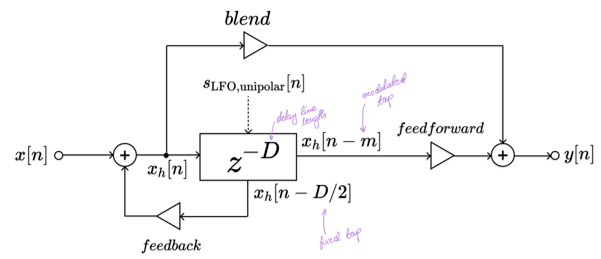
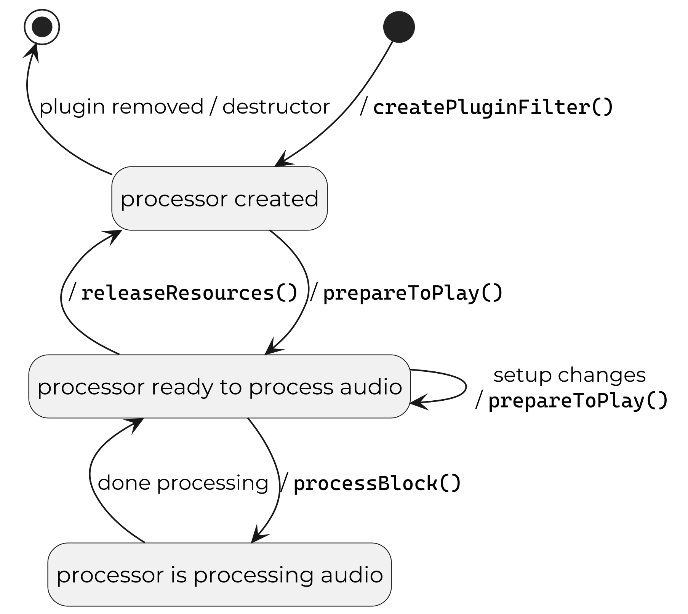

# Beginner’s Guide to C++ Audio Programming with the JUCE Framework

---

<!-- paginate: true -->
<!-- footer: "&copy; WolfSound Jan Wilczek 2026" --->

<style>
h1 {
  color: #EF7600;
}

.inline-images {
    display: flex;
    height: 80%; /* control location on y-axis */
    justify-content: space-evenly;
    align-items: center;
}

img[alt~="align-right"] {
    float: right;
}

img[alt~="align-left"] {
    float: left;
}
</style>

# Introduction


* Jan Wilczek [Yan Vil-check]
* Audio programming consultant & coach
* Founder of TheWolfSound.com blog & YouTube channel
* WolfTalk podcast host
* Online course creator
  * DSP Pro on digital audio signal processing
  * Official JUCE C++ framework audio plugin development course

<!-- I want to enable everyone with Internet access to learn audio programming: the science and art of processing sound using code -->
<!-- Now it's your turn to introduce yourselves! Say a few sentences about yourself and what do you want to achieve through this workshop. -->

---

# Rules

<style scoped>section{font-size:2em;}</style>

* Workshop repo: https://github.com/JanWilczek/cpp-online-26-workshop
* These slides: _docs/slides/cpponline-2026-workshop-slides.md_
* Task descriptions: _docs/tasks/tasks.md_
* Please, have your camera turned on, if possible
  * If you need a break, or some time in quiet, just turn off your camera; we'll know you're not there
* We won't split into break rooms, as there's only 7 of us
* Always ask, when in doubt: feel free to interrupt me
* It's ok not to understand the entire code
* I am here to help you and depending on the needs, I will want to help everyone
* I may skip some of the tasks if we're short on time

---

# Prerequisite: Task 0

_docs/tasks/task0.md_

<!-- Who has done task 0 and compiled the project that's present on the `main` branch? -->
<!-- Who has watched my workshop preview? -->

---

# Part 1: Building a music player in C++

---

# Task: Play back a sine

```bash
git checkout task/generate-sine
```

Focus: *music_player/source/main.cpp*

We'll be using the PortAudio library by Ross Bencina, Phil Burk, et al.

---

# Task: Play back a sine

## Initializing PortAudio

```cpp
const auto error = Pa_Initialize();
//...
if (error == paNoError) {
  Pa_Terminate();
}
```

---

# Task: Play back a sine

## Initializing PortAudio

```cpp
class MusicPlayer {
  //...
  pa_ex::Initializer initializer_;
};
```

---

# Task: Play back a sine

## Creating a stream

```cpp
PaStream* stream;
const auto error = Pa_OpenDefaultStream( &stream, /* many arguments */);
//...
if (stream != nullptr && error == paNoError) {
  Pa_CloseStream(stream_);
}
```

---

# Task: Play back a sine

## Creating a stream

```cpp
class MusicPlayer {
explicit MusicPlayer()
      : stream_{/* many arguments */} {}
  //...
  pa_ex::Stream stream_;
};
```

---

# Task: Play back a sine

## Generating the sine

$$s[n] = A\sin(2\pi f n / f_s),$$

where

* $n$ is the unitless sample index
* $s[n]$ is the discrete output signal
* $f$ is the frequency in Hz
* $f_s$ is the sample rate
* $A$ is the unitless amplitude
* $\pi = 3.14159\dots$

---

# Task: Play back a sine

## Generating the sine

$$s[n] = A\sin(2\pi f n / f_s),$$

```cpp
auto phase_ = 0.f;
//...
constexpr auto amplitude = 0.25f;
const auto outputSample = amplitude * std::sin(phase_);

// output the sample...

constexpr auto frequency = 220.f;
phase_ += 2 * std::numbers::pi_v<float> * frequency / sampleRate_;
```

<!-- Now, all should start working on the task -->
<!-- A word of comment: you can do sine generation and sound playback easily with JUCE -->

---

# Task: Play back an audio file

```bash
git checkout task/file-player
```

Focus:

* _fx/include/fx/fx.h_
* *music_player/source/main.cpp*

We'll be using the AudioFile library by AdamStark.

---

# Task: Flanger audio effect

```bash
git checkout task/flanger-effect
```

Focus:

* _fx/include/fx/fx.h_
* *music_player/source/main.cpp*

---

# Task: Flanger audio effect

## What is Flanger?

Input:

<audio src="../data/Guitar_5th.wav" controls/>

Output:

<audio src="../data/guitar_5th_FlangerTest_FileEnd2EndOutput.wav" controls/>

---

# Task: Flanger audio effect

## What is flanger?

A DSP algorithm that can be depicted as:

* DSP diagram
* Difference equations
* Textual description
* Literature reference
  * ”We will implement equations X-Y from paper Z”

<!-- Difference equations are easiest to implement in code. Diagrams are great for analysis or visual programming languages -->

---

# Sources of DSP algorithms

* Books
* Research papers
* Online blogs & videos
* Online forums
* External consultancy
* Self-design (e.g., through experiments)

---

# How to read DSP diagrams?

* TODO:
* A few simple examples
  * identity
  * delay by 1
  * delay by N
  * nonlinearity

---

# Task: Flanger audio effect

## Flanger DSP diagram



<style scoped>section{font-size:1.5em;}</style>

Source: J. Dattoro. _Effect design, part 2: Delay-line modulation and chorus._ J. Audio Eng. Soc., 45(10): 764–788, October 1997.

<!-- Let's write out the difference equations by tracing back the output to the input -->

---

# Task: Flanger audio effect

## Flanger difference equations

1. Calculate the modulated-delay value

    $$m = s_\text{LFO,unipolar}[n]D.$$

2. Calculate the helper signal sample

    $$x_h[n] = x[n] + \text{feedback } x_h[n-D/2].$$

3. Calculate the output sample

    $$y[n] = \text{blend }x_h[n] + \text{feedforward } x_h[n - m].$$

<!-- Now it's time to implement it -> look at the code to show the structure (esp. `ChannelProcessor`) -->

---

# Part 2: Audio plugin in JUCE C++ framework

---

# Task: Flanger plugin

```bash
git checkout task/flanger-plugin
```

<!-- Have you worked with audio plugins and DAWs before? -->

---

# Digital audio workstation (DAW)


---

# DAW plugins


---

# DAW plugins


---

# Popular plugin APIs

* Audio Unit v3 (AUv3) by Apple for macOS and iOS
* **Virtual Studio Technology 3 (VST3) by Steinberg**
* Avid Audio eXtensions (AAX) by Avid
* LV2 for Linux
* CLever Audio Plug-in (CLAP)

---

# Many plugin formats = development nightmare


---

# Plugin format API abstraction → plugin frameworks


---

# Plugin lifecycle



---

# Task: Flanger plugin

```bash
git checkout task/flanger-plugin
```

<!-- Now it's time to code! -->

---

# Task: Parameters

---

# Part 3: Plugin GUI in JUCE C++ framework

---

# Processor-editor split


---

# Task: Create a custom editor

---

# Task: Add a slider controlling the modulation rate

---

# Task: Style components

---

# Task: Add labels

---

# Task: Add value label

---

# Task: Fonts

---

# Homework

---

# Thank you!

## Where to go from here

* Official JUCE course (free): wolfsoundacademy.com/juce
* DSP course: wolfsoundacademy.com/dsp
  * **40% discount code: CPPO26 (valid until May 26)**
* WolfSound blog: thewolfsound.com
* WolfSound YouTube channel: youtube.com/@WolfSoundAudio
* contact@thewolfsound.com

