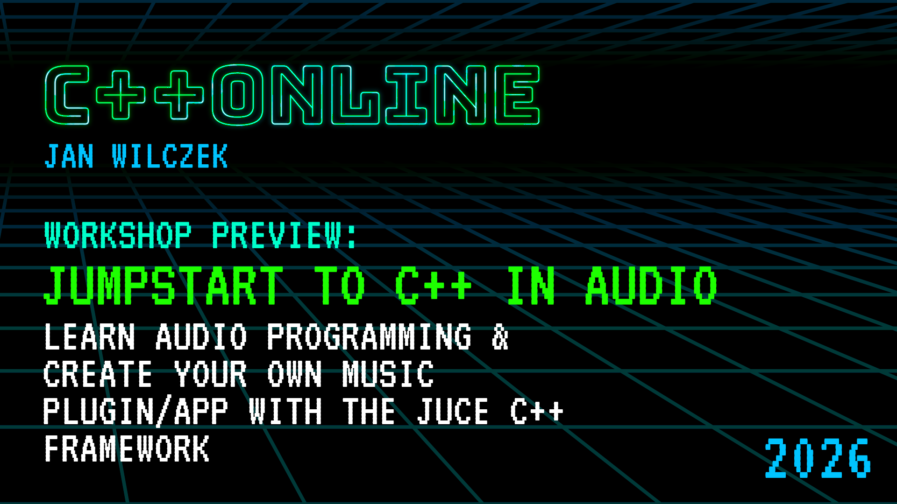

---

<!-- paginate: true -->
<!-- footer: "&copy; WolfSound Jan Wilczek 2026 (TheWolfSound.com) | [cpponline.uk/workshop/jumpstart-to-cpp-in-audio](https://cpponline.uk/workshop/jumpstart-to-cpp-in-audio/)" --->

# About me

* Jan Wilczek [Yan Vil-check]
* Audio programming consultant & coach
* Founder of TheWolfSound.com blog & YouTube channel
* Online course creator
  * DSP Pro on the basics of digital signal processing for audio programming
  * Official JUCE C++ framework audio plugin development course

---

# Assumptions

1. You know basic C++ and you are able to write at least a small C++-oriented program
1. You know what CMake is and how to invoke it (no need to know how to exactly write CMakeLists.txt files)
1. You are interested in music, e.g., you play a musical instrument, you like listening to music, or you perform electronic music


---

# Sound in modern software

1. Streaming/videoconferencing just like we are now
2. Video games
3. Tools for musicians and music producers
4. Embedded applications in microphones, speakers, and smartphones
5. automatic speech recognition
6. text-to-speech

---

# We want to play back sound; how to do it in C++?


---

# What is sound anyway?

---

# What is sound anyway?


---

# How does sound enter the computer?

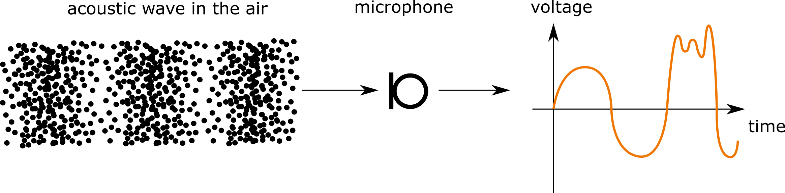

---

# How does sound enter the computer?

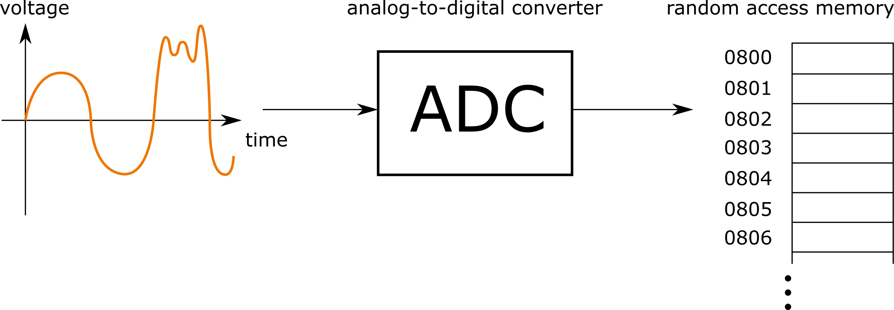

---

# Samples

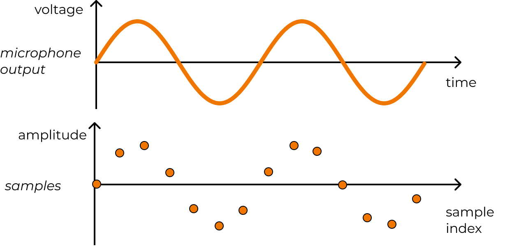

---

# Sampling period & sampling rate

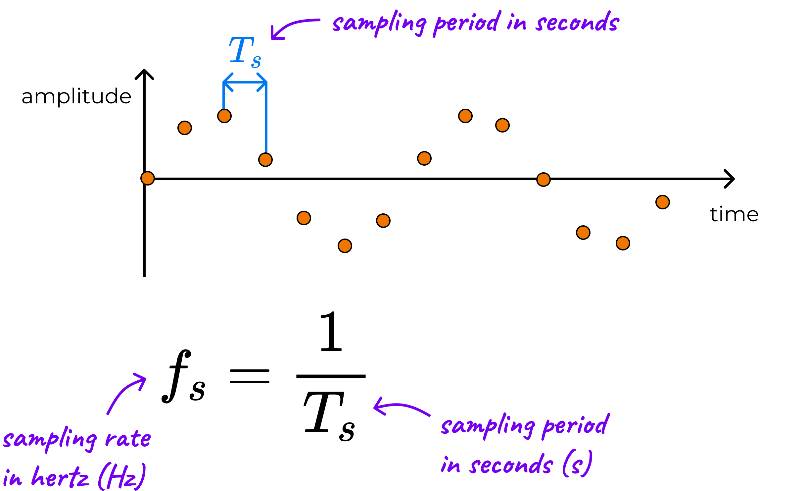

---

# How does sound exit the computer?

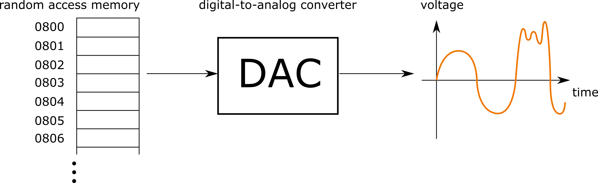

---

# How does sound exit the computer?

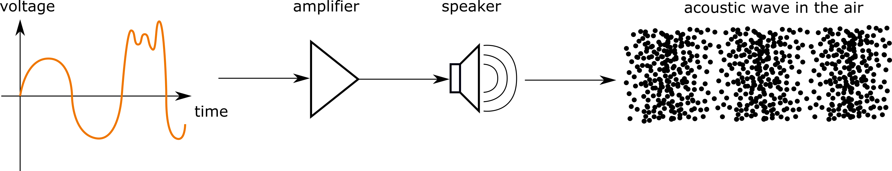

---

# ADC/DAC

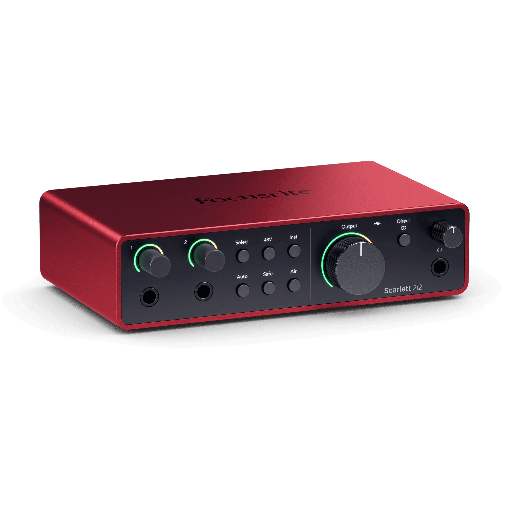


---

# How to play back sound using C++?

---

# How to play back sound using C++?

## No `std::audio`!

---

# How to play back sound using C++?

## No `std::audio`!

We need to use OS-specific APIs, for example,

* CoreAudio on macOS
* DirectSound on Windows
* ALSA on Linux

---

# Isn’t there a cross-platform library that can do it for us?

---

# Isn’t there a cross-platform library that can do it for us?

* PortAudio
* JUCE
* other

---

# How to play back sound using PortAudio?

```cpp
#include <portaudio.h>

const auto error = Pa_Initialize();
```

---

# How to play back sound using PortAudio?

```cpp
const auto error = Pa_Initialize();
//...
if (error == paNoError) {
  Pa_Terminate();
}
```

---

# How to play back sound using PortAudio?

```cpp
class Initializer {
public:
  Initializer() : _error{Pa_Initialize()} {}

  ~Initializer() {
    if (_error == paNoError) {
      Pa_Terminate();
    }
  }

private:
  PaError _error;
};
```

---

# How to play back sound using PortAudio?

```cpp
constexpr auto sampleRate = 44100.;
PaStream* stream;
const auto error = Pa_OpenDefaultStream(
                &stream, 0, 2, paFloat32, sampleRate,
                static_cast<unsigned long>(paFramesPerBufferUnspecified),
                [](const void* input,
                   void* output,
                   unsigned long frameCount,
                   const PaStreamCallbackTimeInfo* timeInfo,
                   PaStreamCallbackFlags statusFlags,
                   void* userData) {
                  return paContinue;
                },
                nullptr);
```

---

# How to play back sound using PortAudio?

```cpp
PaError Pa_OpenDefaultStream( PaStream** stream,
                              int numInputChannels,
                              int numOutputChannels,
                              PaSampleFormat sampleFormat,
                              double sampleRate,
                              unsigned long framesPerBuffer,
                              PaStreamCallback *streamCallback,
                              void *userData );
```

---

# Channels

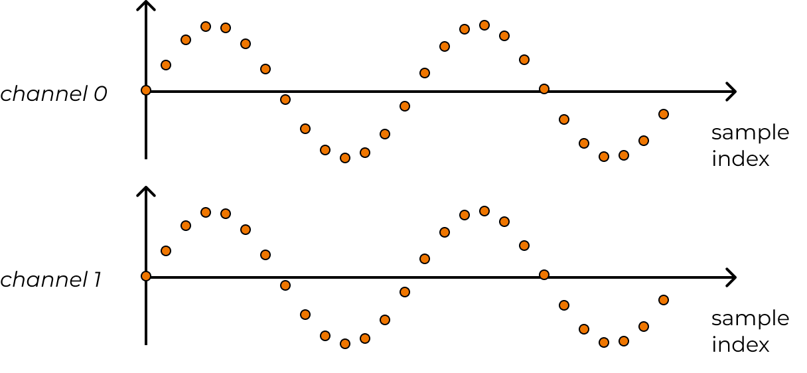

---

# Sample format

* `float` or `double` in the [-1, 1] range (`paFloat32`)
* `int`-like (not used in apps or plugins)

---

# Frames per buffer

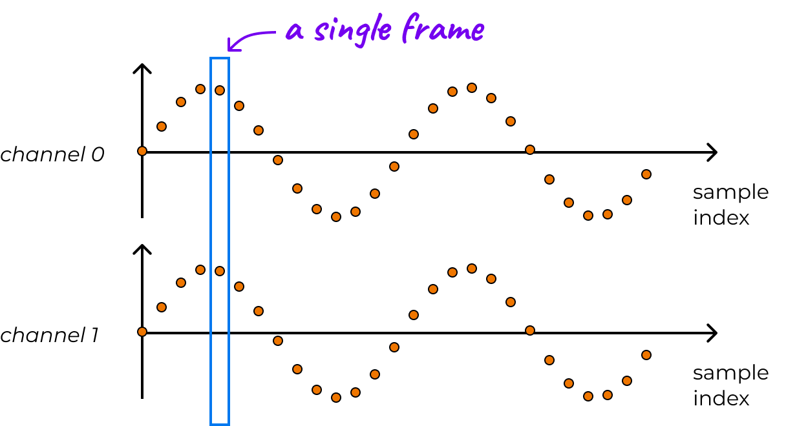

---

# Samples vs frames

* Buffer size = frame count  = samples per channel
* 480 stereo frames in a buffer -> 960 samples

---

# Audio callback

```cpp
typedef int PaStreamCallback(
    const void *input,
    void *output,
    unsigned long frameCount,
    const PaStreamCallbackTimeInfo* timeInfo,
    PaStreamCallbackFlags statusFlags,
    void *userData );
```

* Actual audio processing
* Called ~100 times per second (depending on the sample rate and the buffer size)
* Called on a real-time, high-priority thread
* Must complete within a deadline (soft real-time constraint)

---

# Let's generate a sine

---

# Sine formula

$$s(t) = A\sin(2\pi f t),$$

where
* $t$ is time in seconds
* $s(t)$ is the output signal (a function of time)
* $f$ is the frequency in Hz
* $A$ is the unitless amplitude
* $\pi = 3.14159\dots$

---

# Sine formula

$$s[n] = A\sin(2\pi f n / f_s),$$

where
* $n$ is the unitless sample index
* $s[n]$ is the discrete output signal
* $f$ is the frequency in Hz
* $f_s$ is the sample rate
* $A$ is the unitless amplitude
* $\pi = 3.14159\dots$

---

# Sine formula

$$s[n] = A\sin(2\pi f n / f_s),$$

```cpp
constexpr auto amplitude = 0.25f;
const auto outputSample = amplitude * std::sin(_phase);

// output the sample...

constexpr auto frequency = 220.f;
_phase += 2 * std::numbers::pi_v<float> * frequency / _sampleRate;
```

---

# What is `output`?

```cpp
typedef int PaStreamCallback(
    const void *input,
    void *output,
    unsigned long frameCount,
    const PaStreamCallbackTimeInfo* timeInfo,
    PaStreamCallbackFlags statusFlags,
    void *userData );
```

TODO: Add line highlighting and highlight the line with output

---

# Audio buffer

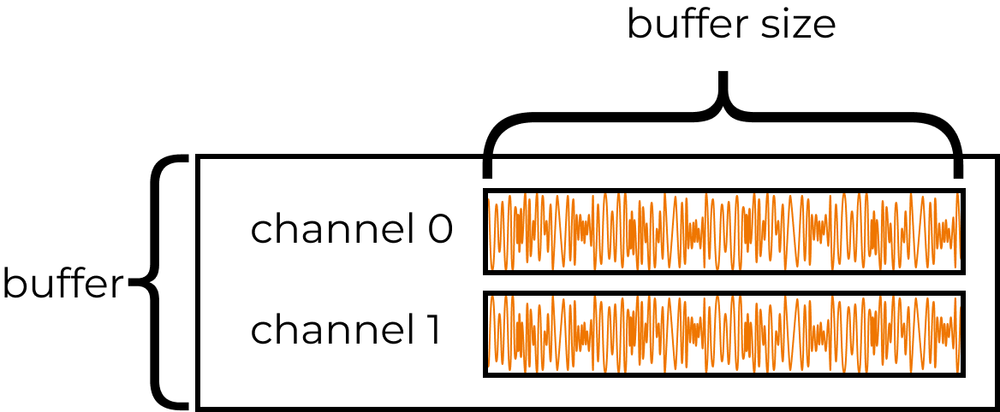

---

# Audio buffer

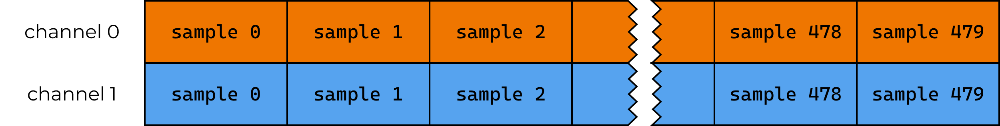

---

# Interleaved vs non-interleaved samples

## Non-interleaved


## Interleaved


---

# Accessing interleaved samples as non-interleaved


```cpp
using AudioBuffer =
    std::mdspan<float, std::dextents<int, 2>, std::layout_left>;

auto buffer = AudioBuffer{static_cast<float*>(output), 2, 480};
```


---

# Output the sine sample to all channels

```cpp
for (const auto frame : std::views::iota(0, buffer.extent(1))) {
  constexpr auto amplitude = 0.25f;
  const auto outputSample = amplitude * std::sin(_phase);

  for (const auto channel : std::views::iota(0, buffer.extent(0))) {
    buffer[channel, frame] = outputSample;
  }

  constexpr auto frequency = 220.f;
  _phase += 2 * std::numbers::pi_v<float> * frequency / _sampleRate;
}
```

---

# Don’t test using headphones!

<audio src="../data/sine220.0Hz5.0s.wav" controls/>

---

# Cleanup

```cpp
Pa_StopStream(stream);
Pa_CloseStream(stream);
```

---

```cpp
class Stream {
public:
  template <typename... Ts>
  explicit Stream(Ts&&... args)
      : _error{Pa_OpenDefaultStream(&_stream, std::forward<Ts>(args)...)} {}

  ~Stream() {
    if (_stream != nullptr && _error == paNoError) {
      Pa_CloseStream(_stream);
    }
  }

  // deleted copy constructor & assignment operator
  // move constructor & assignment operator

  void start() { Pa_StartStream(_stream); }

  void stop() { Pa_StopStream(_stream); }

private:
  PaStream* _stream{nullptr};
  PaError _error{paNoError};
};
```

---

# Summary: Starting audio playback in C++

1. Connect to the audio device (if exists)
2. Register the audio callback
3. Ask the audio device to start pulling samples at a set sample rate
4. Consume/produce samples in the audio callback
5. Stop playback
6. Close the connection to the audio device

---

# Why C++ for audio?

* High-level zero-cost abstractions
* Easy C and Objective-C interoperability
* OS audio APIs are in C++ (Windows, Android) or C
* **Powerful C or C++ libraries and frameworks related to audio**
  * FFmpeg
  * JUCE C++ framework

---

# Ok, we know how to play back a sound. How to play back an audio file?

---

# Use the AudioFile library

```cpp
// somewhere
std::filesystem::path filepath{"Guitar_5th.wav"};
AudioFile<float> file;
size_t playhead = 0u;
file.load(filepath.string());
// audio callback:
const auto channelCount =
    std::min(buffer.extent(0), file.getNumChannels());

for (const auto frame : std::views::iota(0, buffer.extent(1))) {
  if (_playhead < file.getNumSamplesPerChannel()) {
    for (const auto channel : std::views::iota(0, channelCount)) {
      buffer[channel, frame] = file.samples[channel][playhead];
    }
    playhead++;
  }
}
```

---

# Audio file playback

<audio src="../data/Guitar_5th.wav" controls/>

---

# Why not read the file in the audio callback?

* Audio callback must complete within a time limit (**real-time programming**)
  * otherwise we get a glitch
* File I/O is a system call ➡️ unbounded execution time
* Similarly, we cannot
  * allocate/deallocate
  * do network calls
  * take a lock on a mutex
  * start threads, wait for threads
  * call functions with unbounded execution time
  * ...

---

# We have a nice music player, but what if we want to apply an effect to it?

---

# How to apply an effect to the played-back audio?

## ➡️ digital audio signal processing

---

# An audio effect: Flanger


---

# An audio effect: Flanger


Legend:

* $x[n]$ is the input signal
* $y[n]$ is the output signal
* $x_h[n]$ is a helper signal (used for convenience)
* $D$ is the length of the delay line
* $\text{feedforward}$, $\text{feedback}$, and $\text{blend}$ are coefficients (all equal to 0.7 for a flanger)
* $s_\text{LFO,unipolar}[n]$ is the unipolar LFO signal (a sine in the [0, 1] range)
* $m$ is the modulated delay value
* $x_h[n-D/2]$ denotes the helper signal delayed by $D/2$ samples

> [!NOTE]
> $m$ depends on $n$ but I write $m$ instead of $m[n]$ for simplicity. If you want, you can make the dependence explicit 😉

---

# Low-frequency oscillator (LFO)

## Bipolar

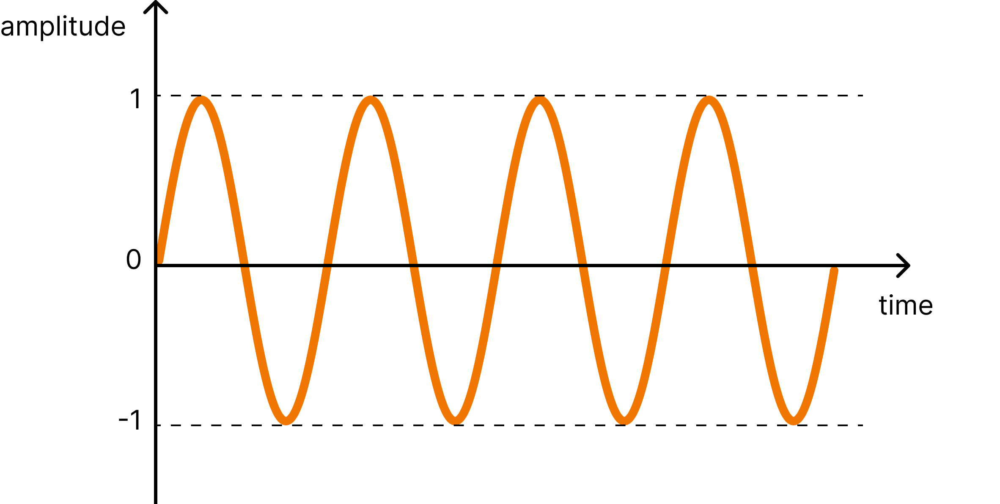

## Unipolar

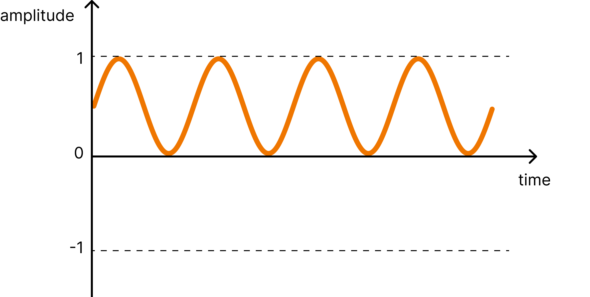

---

# Flanger difference equations

3. Output sample

$$y[n] = \text{blend } x_h[n] + \text{feedforward } x_h[n-m]$$

2. Helper sample

$$x_h[n] = x[n] + \text{feedback } x_h[n-D/2]$$

1. Modulated-delay value

$$m=s_\text{LFO,unipolar}[n]D$$

---

# `Flanger` class

```cpp
class Flanger {
public:
  void prepare(double sampleRate) {
    constexpr auto MAX_DELAY_SECONDS = 0.002;
    maxDelay_ =
        static_cast<float>(std::ceil(sampleRate * MAX_DELAY_SECONDS));
    middleDelay_ = maxDelay_ / 2.f;
    lfo_.prepare(sampleRate);
  }

  float processSample(float sample) {
    const auto& x = sample;
    const auto xh = x + feedback_ * delayLine_.popSample(middleDelay_);

    const auto lfoUnipolarValue = (lfo_.processSample(0) + 1) / 2;
    const auto currentDelay = lfoUnipolarValue * maxDelay_;

    const auto y =
        blend_ * xh + feedforward_ * delayLine_.popSample(currentDelay);

    delayLine_.pushSample(xh);

    return y;
  }

private:
  float feedforward_ = 0.7f;
  float feedback_ = 0.7f;
  float blend_ = 0.7f;
  FractionalDelayLine delayLine_;
  juce::dsp::Oscillator<float> lfo_{
      [](auto phase) { return std::sin(phase); }, 128u};
  float maxDelay_{};
  float middleDelay_{};
};
```

---

# Flanger applied

<audio src="../data/guitar_5th_FlangerTest_FileEnd2EndOutput.wav" controls>

---

# Audio processors

```cpp
class SineGenerator {
public:
  void prepare(double sampleRate);
  void processBlock(AudioBuffer buffer);
};
class FilePlayer {
public:
  void prepare(double sampleRate);
  void processBlock(AudioBuffer buffer);
};
class Flanger {
public:
  void prepare(double sampleRate);
  void processBlock(AudioBuffer buffer);
};
```

---

# `AudioProcessor`

```cpp
class AudioProcessor {
public:
  virtual ~AudioProcessor() = default;

  virtual void prepareToPlay([[maybe_unused]] double sampleRate) {}

  using AudioBuffer =
      std::mdspan<float, std::dextents<int, 2>, std::layout_left>;
  virtual void processBlock(AudioBuffer) = 0;
};
```

---

# Processing chain

```cpp
std::vector<std::unique_ptr<AudioProcessor>> processors;
//...
for (auto& processor : processors) {
  processor->processBlock(buffer);
}
```

---

# Digital audio workstation (DAW)

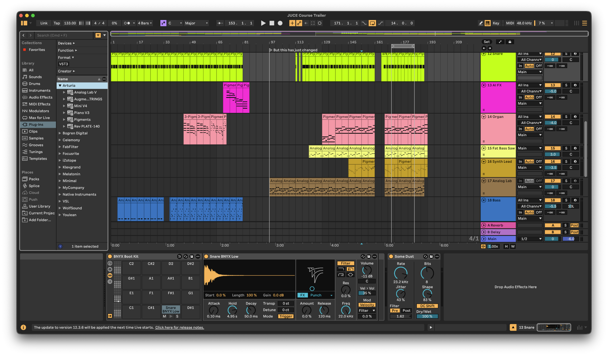

---

1. How to add effects to a DAW? → plugins

---

8. Plugin formats

---

9. Plugin format API abstraction → plugin frameworks

---

# JUCE C++ framework


* Cross-platform application development framework (think Qt)
* Easy audio plugin & plugin host development
  * Automatic build to almost all plugin formats
* Many audio-related features
  * audio effects, synthesis, MIDI handling, audio device abstraction, audio file reading...
* Official JUCE audio plugin development course (free): [wolfsoundacademy.com/juce](https://wolfsoundacademy.com/juce)

---

# Workshop flanger plugin

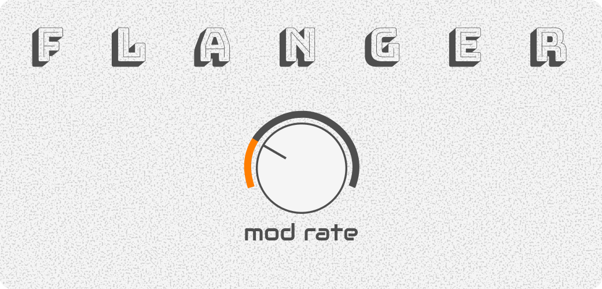

---

# What you will learn from the workshop

* How to represent sound on a computer
* How to play back sound in a cross-platform way
* How to play back an audio file, for example, for your video game
* How to apply an audio effect to your sound
* How to create a cross-platform audio plugin (flanger) for a DAW
* How modern audio apps work
* What to avoid when processing audio
* How audio programming differs from regular C++ programming
* Where you can find more information for your personal projects or career transition

---

# Workshop outline

Introduction: Compiling workshop code
Part 1 - Digital sound essentials: Minimal introduction to digital audio concepts
Part 2 - Playing back sound
Part 3 - Modifying the played back sound
Break
Part 4 - Building an audio app/plugin with a user interface using the JUCE C++ framework
Part 5 - Summary & where to go from here

---

# Workshop prerequisites

* Basic C++ knowledge
* Understanding of basic CMake commands
* CMake, git, C++ compiler and build system installed (Xcode on macOS, Visual Studio on Windows, gcc & make on Linux) - most recent versions preferred, so please update if you can
* [Reaper DAW installed](https://reaper.fm) (trial version); recommended for beginners
* Linux users: please, install the necessary Linux packages [according to the JUCE documentation](https://github.com/juce-framework/JUCE/blob/master/docs/Linux%20Dependencies.md)

---

# Workshop timeslots

Tuesday 14th April 13:00 - 20:00 UTC
Tuesday 28th April 07:00 - 14:00 UTC

[cpponline.uk/workshop/jumpstart-to-cpp-in-audio](https://cpponline.uk/workshop/jumpstart-to-cpp-in-audio/)

---

# Summary

Tuesday 14th April 13:00 - 20:00 UTC
Tuesday 28th April 07:00 - 14:00 UTC

[cpponline.uk/workshop/jumpstart-to-cpp-in-audio](https://cpponline.uk/workshop/jumpstart-to-cpp-in-audio/)

* Audio is processed in samples at a sample rate in the callback of the audio device
* Audio callback code must be real-time-safe: complete within the deadline
* C++ is the most popular language for real-time audio processing
* Digital signal processing is the theory of audio-related algorithms
